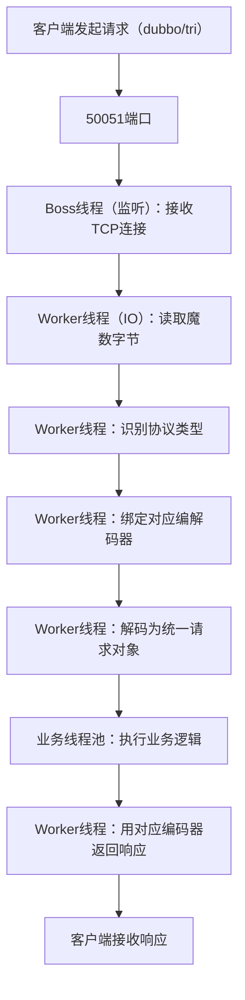

# 单端口多协议完整总结

## 一、核心定义
这是 Dubbo 3.x 推出的**平滑升级扩展能力**，允许服务提供者在**单个端口（如 50051）上同时监听并处理 `dubbo`（2.x 私有协议）和 `tri`（3.x 新协议）两种请求**，无需新增端口或修改业务代码。

## 二、核心价值
1.  **零成本兼容老系统**
    老用户无需额外改造，即可在保留 `dubbo` 协议的同时，新增 `tri` 协议支持，避免全量升级风险。
2.  **平滑过渡云原生**
    让老系统的 `dubbo` 协议调用与新系统的 `tri` 协议调用共存，逐步完成技术栈升级。
3.  **降低运维复杂度**
    避免多端口带来的配置、监控和运维成本，用一个端口承载多协议能力。
4.  **场景按需适配**
    内部 Java 服务用 `dubbo` 协议保证性能，跨语言/前端直连用 `tri` 协议保证兼容性。

## 三、底层实现
1.  **协议自动识别（核心）**
    - **识别线程**：发生在 Netty 的 `Worker 线程`（IO 线程）中，而非业务服务线程。
    - **识别时机**：Worker 线程读取请求的前几个字节（协议魔数）后、解码请求前。
    - **识别逻辑**：通过魔数区分协议（`dubbo` 魔数 `0xdabb`，`tri` 魔数 `0x50524900`），为连接绑定对应编解码器（`DubboCodec`/`TripleCodec`）。
2.  **资源共享**
    - 底层共享一套 Netty 线程池（Boss/Worker 线程）和业务服务实例，仅在协议编解码层做差异化处理，性能损耗极低。
    - 业务线程池完全无协议感知，只处理统一的请求对象，实现“一套业务逻辑，兼容多协议”。
3.  **配置极简**
    只需在服务提供者配置中开启 `ext-protocols: dubbo`，即可在 `tri` 协议的端口上同时支持 `dubbo` 协议。

## 四、线程执行链路
```
客户端发起请求 → 50051端口 → Boss线程（监听）接收TCP连接 → Worker线程（IO）读取魔数字节 → Worker线程识别协议类型 → Worker线程绑定对应编解码器 → Worker线程解码为统一请求对象 → 业务线程池执行业务逻辑 → Worker线程用对应编码器返回响应 → 客户端接收响应
```

## 五、适用场景
- **Dubbo 2.x 升级到 3.x**：让老服务无需重构即可支持 `tri` 协议。
- **多场景兼容**：内部 Java 服务用 `dubbo` 协议保证性能，跨语言/前端直连用 `tri` 协议保证兼容性。
- **运维轻量化**：减少端口占用，简化监控和部署配置。

你的问题问到了单端口多协议最核心的技术细节——**协议自动识别发生在「网络监听的Worker线程」中，且是在IO读写阶段、请求进入业务服务线程之前完成的**。我会把识别的完整链路拆到线程级别，让你精准知道每一步发生在哪个线程、哪个阶段。

### 一、核心结论
协议自动识别的核心链路：
`Boss线程接收连接` → `Worker线程读取字节流` → `Worker线程内完成协议识别` → `Worker线程调用对应编解码器` → `业务线程处理核心逻辑`
简单说：**识别动作发生在处理IO的Worker线程中，而非执行业务的服务线程**。

### 二、分线程/分阶段拆解识别过程（以50051端口为例）
#### 阶段1：Boss线程（监听线程）—— 只负责“接连接”，不识别协议
- **线程类型**：Netty的Boss线程（单线程，核心职责是监听端口）；
- **核心动作**：监听50051端口的TCP连接请求（不管是dubbo还是tri协议，都是TCP连接），接收到连接后，把连接分配给Worker线程；
- **关键特点**：Boss线程完全不处理协议相关逻辑，只做连接的“分发”。

#### 阶段2：Worker线程（IO线程）—— 核心的协议识别环节
这是协议识别的**核心线程和核心阶段**，所有协议识别逻辑都在这一步完成：
1. **读取字节流**：Worker线程从TCP连接中读取请求的前几个字节（协议魔数）；
    - dubbo协议的魔数是固定的4个字节：`0xdabb`（十六进制）；
    - tri协议的魔数是固定的4个字节：`0x50524900`（十六进制）；
2. **协议识别**：Worker线程调用Dubbo内置的`ProtocolDetector`（协议检测器），根据魔数字节判断协议类型；
3. **绑定编解码器**：识别出协议类型后，Worker线程会为当前连接绑定对应的编解码器：
    - 识别为dubbo协议 → 绑定`DubboCodec`；
    - 识别为tri协议 → 绑定`TripleCodec`；
4. **解码请求**：用绑定的编解码器把字节流解码为Dubbo能识别的请求对象（如`Invocation`）。

#### 阶段3：业务线程（服务线程）—— 只处理业务，无协议感知
- **线程类型**：Dubbo的业务线程池（默认是`FixedThreadPool`，可配置）；
- **核心动作**：Worker线程把解码后的请求对象提交到业务线程池，业务线程调用`DemoService`的实现类执行业务逻辑；
- **关键特点**：业务线程完全不知道“请求是dubbo还是tri协议来的”，只处理统一的请求对象，实现了“协议无关的业务逻辑”。

### 三、关键补充：为什么识别要放在Worker线程？
1. **性能最优**：协议识别只需要读取前几个字节，属于轻量操作，放在IO线程（Worker）中可以避免请求进入业务线程池后再做识别，减少线程切换成本；
2. **IO语义匹配**：协议魔数是字节流层面的特征，必须在IO读取阶段识别，否则无法对后续字节流做正确的编解码；
3. **连接级绑定**：一个TCP连接上的所有请求通常是同一种协议，Worker线程识别后会为连接永久绑定编解码器，后续请求无需重复识别，提升效率。

### 四、线程链路总结（可视化）


### 最终总结
协议自动识别的核心：
1. 识别动作发生在**处理IO的Worker线程**中，而非执行业务的服务线程；
2. 识别时机是“Worker线程读取请求字节流后、解码请求前”；
3. 业务线程完全无协议感知，只处理统一的请求对象，实现了“一套业务逻辑，兼容多协议”。

简单说：Worker线程是“协议翻译官”，先识别请求的“语言（协议）”，翻译成统一的“内部语言（请求对象）”后，再交给业务线程处理；业务线程只需要懂“内部语言”，不用管外部用的是什么“语言”。