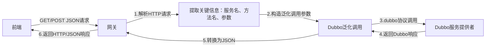

你问到的这个场景是Dubbo生态中**网关适配HTTP→Dubbo协议**的核心方案，我会用「通俗解释+核心原理+实操逻辑」的方式拆解，让你彻底理解“泛化调用”解决的问题、以及它在网关中的作用。

### 先讲核心结论
这句话的核心是：
1. Dubbo 2.x的私有`dubbo`协议是**二进制私有协议**，无法直接处理前端的HTTP/JSON请求（比如浏览器、APP发的GET/POST）；
2. 网关（如Nginx、Spring Cloud Gateway、Dubbo Gateway）需要做「协议转换」：把前端的HTTP/JSON请求，转成后端Dubbo服务能识别的`dubbo`协议调用；
3. Dubbo的**泛化调用**，就是让网关在「不依赖后端服务接口Jar包、不写接口代码」的前提下，动态调用任意Dubbo服务——这是网关能通用适配所有Dubbo服务的关键。

### 一、先理解：为什么需要泛化调用？（对比普通调用）
#### 1. 普通Dubbo调用（非网关场景）
你之前接触的Dubbo调用，都需要**依赖服务接口的Jar包**（比如`DemoService.class`），步骤是：
```java
// 1. 必须引入服务接口Jar包，才能拿到DemoService类
import org.lix.DemoService;

// 2. 通过ReferenceConfig引用，指定接口类
ReferenceConfig<DemoService> reference = new ReferenceConfig<>();
reference.setInterface(DemoService.class); 
// 3. 获取代理对象，调用方法（必须知道方法名、参数类型）
DemoService demoService = reference.get();
demoService.sayHello("Dubbo");
```
这种方式的问题：网关如果要调用100个Dubbo服务，就需要引入100个服务的接口Jar包，且接口变更时网关必须同步升级——这在网关这种“通用中间件”场景下完全不可行。

#### 2. 泛化调用（网关场景）
泛化调用的核心是**“无接口类依赖”**：网关不需要引入任何服务的接口Jar包，只需要知道「服务名、方法名、参数类型、参数值」，就能动态调用任意Dubbo服务，步骤简化为：
```java
// 1. 无需引入接口Jar包，只需指定接口全类名字符串
ReferenceConfig<GenericService> reference = new ReferenceConfig<>();
reference.setInterface("org.lix.DemoService"); // 字符串指定接口
reference.setGeneric(true); // 开启泛化调用

// 2. 获取泛化服务代理（GenericService是Dubbo通用接口）
GenericService genericService = reference.get();

// 3. 动态调用方法：传入方法名、参数类型数组、参数值数组
Object result = genericService.$invoke(
    "sayHello", // 方法名（字符串）
    new String[]{"java.lang.String"}, // 参数类型（字符串数组）
    new Object[]{"Dubbo"} // 参数值（对象数组）
);
```
核心差异：普通调用依赖「接口类」，泛化调用只依赖「字符串参数」，完全解耦了网关和后端服务的接口依赖。

### 二、泛化调用在“HTTP→Dubbo”网关中的完整流程
结合你关心的“前端HTTP请求调用Dubbo服务”，网关的完整处理逻辑如下：


#### 分步拆解（实操视角）：
假设前端发起HTTP请求：
```http
POST http://网关IP:8080/dubbo/invoke
Content-Type: application/json

{
  "serviceName": "org.lix.DemoService", // 要调用的Dubbo服务接口名
  "methodName": "sayHello",            // 要调用的方法名
  "paramTypes": ["java.lang.String"],  // 参数类型数组
  "params": ["Dubbo"]                  // 参数值数组
}
```

网关的处理逻辑：
1. **解析HTTP请求**：从JSON中提取`serviceName`、`methodName`、`paramTypes`、`params`；
2. **初始化泛化调用**：创建`ReferenceConfig<GenericService>`，设置`interface=serviceName`、`generic=true`；
3. **发起泛化调用**：调用`genericService.$invoke(methodName, paramTypes, params)`；
4. **协议转换**：Dubbo服务返回的结果是Java对象，网关将其转为JSON；
5. **返回HTTP响应**：把JSON结果返回给前端。

### 三、泛化调用的核心特性（为什么适合网关）
1. **无接口依赖**：网关无需引入任何后端服务的接口Jar包，适配新服务时无需修改网关代码；
2. **动态性**：支持动态指定服务名、方法名、参数，能调用任意Dubbo服务；
3. **兼容性**：支持Dubbo所有核心特性（版本、分组、超时、重试），只需在`ReferenceConfig`中配置：
   ```java
   reference.setVersion("1.0.0"); // 指定服务版本
   reference.setGroup("dev");     // 指定服务分组
   reference.setTimeout(3000);    // 设置超时
   ```
4. **适配HTTP/JSON**：网关接收的HTTP/JSON参数，可直接转为泛化调用的`Object[]`参数，无需手动适配接口类型。

### 四、Dubbo 3.x Triple协议 vs 泛化调用（补充对比）
你之前问的Triple协议，其实是Dubbo 3.x解决“HTTP直连Dubbo服务”的更优方案——Triple协议本身支持HTTP/JSON直连（无需网关转换），而泛化调用是Dubbo 2.x时代的网关适配方案：
| 方案                | 核心优势                  | 适用场景                  |
|---------------------|---------------------------|---------------------------|
| 泛化调用（网关转换） | 适配Dubbo 2.x私有协议     | Dubbo 2.x老服务、无法升级 |
| Triple协议（直连）| 无需网关、直接支持HTTP/JSON | Dubbo 3.x新服务、跨语言调用 |

### 核心总结
1. **泛化调用的本质**：Dubbo提供的「无接口类依赖」的动态调用能力，只需通过字符串指定服务名、方法名、参数，就能调用任意Dubbo服务；
2. **网关的作用**：解决Dubbo私有协议无法处理HTTP请求的问题，通过“HTTP解析→泛化调用→结果转换”完成HTTP→Dubbo的协议转换；
3. **核心价值**：网关无需依赖后端服务的接口Jar包，实现对所有Dubbo服务的通用适配，是Dubbo 2.x时代前端调用Dubbo服务的核心方案；
4. **Dubbo 3.x建议**：优先用Triple协议直接暴露HTTP/JSON接口，无需网关和泛化调用，更简洁高效。

简单说：泛化调用就是Dubbo为网关这类“通用中间件”量身打造的「万能调用工具」，让网关能“看不懂Dubbo服务接口，也能调用它”。