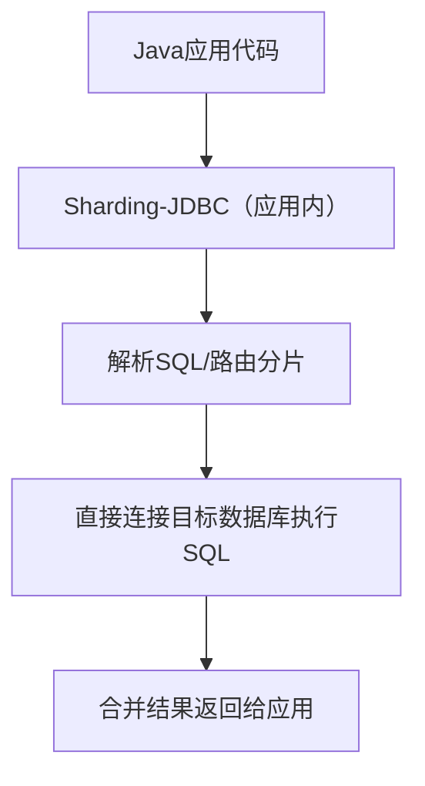
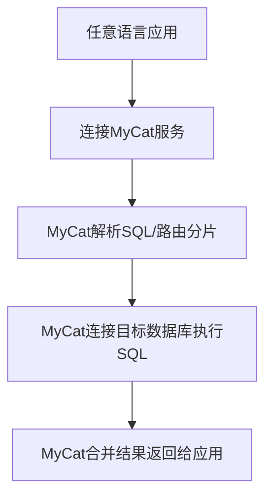

你想弄清楚 MyCat 和 Sharding-JDBC（ShardingSphere-JDBC）这两款分布式数据库中间件的核心区别，其实它们的核心定位都是解决数据库分库分表、读写分离问题，但架构形态、部署方式、适用场景等方面差异极大，我会从核心维度对比，帮你清晰区分两者的选择逻辑。

### 一、核心定位与架构差异（最根本区别）
#### 1. Sharding-JDBC（客户端中间件）
- **定位**：**嵌入式、轻量级的客户端分片框架**，运行在应用进程内部，属于“应用层分片”；
- **架构**：无中心化，没有独立的服务进程，本质是对 JDBC 接口的增强（封装了原生 JDBC 驱动）；
- **通信方式**：应用直接通过 Sharding-JDBC 连接数据库，中间无额外网络跳转。

#### 2. MyCat（服务端中间件）
- **定位**：**独立部署的服务端中间件**，属于“代理层分片”，对外暴露统一的数据库连接地址；
- **架构**：中心化架构，需要独立部署 MyCat 服务集群，应用不直接连数据库，而是连接 MyCat；
- **通信方式**：应用 → MyCat 服务 → 数据库，多一层网络转发。

### 二、核心维度对比表
| 对比维度 | Sharding-JDBC（ShardingSphere-JDBC） | MyCat |
|----------|--------------------------------------|-------|
| **部署形态** | 嵌入式，随应用进程启动，无独立进程 | 独立服务，需部署/运维 MyCat 集群 |
| **架构类型** | 客户端分片（无中心） | 服务端分片（有中心） |
| **网络开销** | 无额外网络跳转，性能接近原生 JDBC | 多一层网络转发，性能有损耗 |
| **侵入性** | 对应用有轻微侵入（需引入依赖/配置），对业务代码无侵入 | 对应用完全无侵入（仅需改数据库连接地址） |
| **跨语言支持** | 仅支持 Java 应用（基于 JDBC） | 支持所有语言（基于 MySQL 协议） |
| **运维成本** | 低（无额外中间件集群） | 高（需维护 MyCat 集群、监控、扩容） |
| **功能覆盖** | 分库分表、读写分离、分布式事务、数据加密、影子库等 | 分库分表、读写分离、数据分片，事务支持较弱 |
| **适用场景** | Java 技术栈的微服务/单体应用，追求高性能、低运维成本 | 多语言技术栈（Java/PHP/Python 等），需统一数据库接入层 |
| **故障影响** | 单个应用进程故障，不影响其他应用 | MyCat 集群故障会影响所有连接的应用 |

### 三、工作原理对比（直观理解）
#### 1. Sharding-JDBC 工作流程

核心：分片逻辑在应用内完成，直接操作数据库，无中间转发。

#### 2. MyCat 工作流程

核心：所有数据库请求先经过 MyCat 代理，再转发到数据库。

### 四、具体使用场景选择
#### 优先选 Sharding-JDBC 的场景
1. 技术栈以 Java 为主（如 Spring Boot/Spring Cloud 微服务）；
2. 追求高性能，对数据库访问延迟敏感；
3. 运维团队人力有限，不想维护额外的中间件集群；
4. 需要分布式事务、数据加密等高级功能；
5. 单体应用或小规模微服务集群。

#### 优先选 MyCat 的场景
1. 系统包含多语言开发的应用（如 Java 后端 + PHP 前端服务）；
2. 希望对应用完全屏蔽数据库分片细节（仅改连接地址即可）；
3. 已有成熟的中间件运维团队，能维护 MyCat 集群；
4. 非 Java 应用需要接入分库分表（如 Python/Go 项目）。

### 五、实操层面的差异（简单示例）
#### 1. Sharding-JDBC 接入（Java 应用）
- 需引入 Maven 依赖，在应用配置文件中定义分片规则；
- 应用直接配置数据库地址，Sharding-JDBC 内部路由；
- 业务代码调用 JDBC/MyBatis 无感知。

#### 2. MyCat 接入（任意应用）
- 先部署 MyCat 服务，在 MyCat 中配置分片规则、数据库集群地址；
- 应用只需将数据库连接地址改为 MyCat 的地址（如 `jdbc:mysql://mycat-server:8066/order_db`）；
- 应用完全无需修改代码，也无需引入额外依赖。

### 总结
1. **核心差异**：Sharding-JDBC 是**客户端嵌入式**方案（Java 专属、高性能、低运维），MyCat 是**服务端代理**方案（跨语言、高运维、无侵入）；
2. **选型关键**：Java 技术栈优先 Sharding-JDBC，多语言栈/需统一接入层优先 MyCat；
3. **性能与运维**：Sharding-JDBC 性能更优、运维成本低，MyCat 性能有损耗、运维成本高。

简单记：Sharding-JDBC 是“应用自带分片能力”，MyCat 是“专门的分片代理服务”。