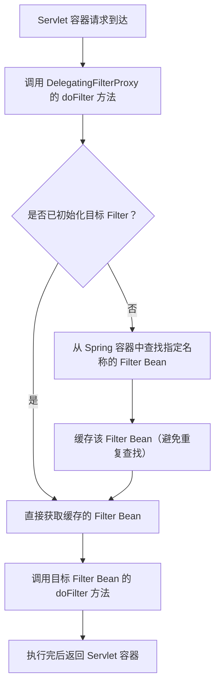

你现在想了解 `DelegatingFilterProxy` 的核心作用，这个类是 Spring Web 中处理「Servlet Filter」与「Spring Bean」集成的关键组件，尤其在你自定义 Nacos 配置加载、手动管理 Bean 生命周期的场景下，理解它能帮你理清 Spring 容器与 Servlet 容器的协作逻辑。

### 核心需求复述
你想明确 `DelegatingFilterProxy` 的作用、原理，以及它在实际开发中的应用场景，结合你之前手动实现 `BeanPostProcessor`、管理 Spring Bean 的背景，我会从“是什么-为什么需要-怎么用-核心原理”四个维度讲清楚。

### 一、`DelegatingFilterProxy` 核心作用
一句话总结：**`DelegatingFilterProxy` 是 Spring 提供的一个「桥接类」，将 Servlet 容器管理的 Filter 委托给 Spring 容器中的 Bean 来实现**。

具体拆解为 3 个核心作用：
1. **打通两个容器**：Servlet 容器（如 Tomcat）和 Spring 容器是独立的——Servlet Filter 由 Servlet 容器初始化管理，而业务逻辑的 Bean 由 Spring 容器管理。`DelegatingFilterProxy` 作为 Servlet Filter 注册到 Servlet 容器，内部却去 Spring 容器中查找真正的 Filter Bean 并调用其逻辑，实现了两个容器的互通。
2. **延迟初始化 Filter**：真正的 Filter 作为 Spring Bean，可以享受 Spring 的所有特性（依赖注入、AOP、`@Value` 读取配置、`@RefreshScope` 动态刷新等），而无需在 Servlet 容器启动时就初始化（避免 Filter 初始化早于 Spring Bean 导致依赖注入失败）。
3. **解耦 Filter 管理**：真正的 Filter 可以像普通 Spring Bean 一样被管理（如通过 `@Component` 注册、通过配置类条件化创建），而不用硬编码到 `web.xml` 或 Servlet 容器的初始化逻辑中，符合 Spring “控制反转”的设计思想。

### 二、为什么需要它？（没有它会有什么问题）
假设你不使用 `DelegatingFilterProxy`，直接自定义一个 Servlet Filter：
```java
// 普通 Servlet Filter（由 Tomcat 初始化）
public class MyFilter implements Filter {
    // 依赖 Spring 容器中的 Bean
    @Autowired
    private MyCustomConfig config; // ❌ 注入失败：Tomcat 初始化 Filter 时，Spring 容器可能还没启动，或无法感知 Spring Bean

    @Override
    public void doFilter(ServletRequest request, ServletResponse response, FilterChain chain) {
        // 业务逻辑
    }
}
```
问题核心：Servlet 容器和 Spring 容器是两个独立的上下文，直接的 Servlet Filter 无法享受 Spring 的依赖注入、配置读取等特性。

而使用 `DelegatingFilterProxy` 后，真正的 Filter 可以是 Spring Bean：
```java
// 真正的 Filter 作为 Spring Bean（由 Spring 管理）
@Component
public class MySpringFilter implements Filter {
    @Autowired
    private MyCustomConfig config; // ✅ 注入成功：Spring 管理的 Bean 可正常依赖注入

    @Override
    public void doFilter(ServletRequest request, ServletResponse response, FilterChain chain) {
        // 业务逻辑
    }
}
```
`DelegatingFilterProxy` 作为“代理”，会从 Spring 容器中找到 `MySpringFilter` 这个 Bean，并委托它处理过滤逻辑。

### 三、核心原理（执行流程）
用流程图清晰展示 `DelegatingFilterProxy` 的工作过程：



关键细节：
1. **查找目标 Filter 的规则**：默认情况下，`DelegatingFilterProxy` 的名称就是目标 Filter Bean 的名称；也可通过初始化参数 `targetBeanName` 指定。
2. **延迟初始化**：只有第一次请求到达时，才会从 Spring 容器中查找目标 Filter Bean，确保 Spring 容器已完全启动，Bean 已初始化完成。
3. **生命周期对齐**：目标 Filter Bean 的 `init()` 和 `destroy()` 方法也会由 `DelegatingFilterProxy` 代理调用，保证 Filter 生命周期完整。

### 四、实际使用场景（两种配置方式）
#### 1. 传统 XML 配置（web.xml）
```xml
<!-- 注册 DelegatingFilterProxy 到 Servlet 容器 -->
<filter>
    <filter-name>mySpringFilter</filter-name>
    <filter-class>org.springframework.web.filter.DelegatingFilterProxy</filter-class>
    <!-- 可选：指定目标 Filter Bean 名称（默认用 filter-name） -->
    <init-param>
        <param-name>targetBeanName</param-name>
        <param-value>mySpringFilter</param-value>
    </init-param>
</filter>
<filter-mapping>
    <filter-name>mySpringFilter</filter-name>
    <url-pattern>/*</url-pattern>
</filter-mapping>
```

#### 2. Spring Boot 配置（推荐，无 XML）
Spring Boot 中无需手动注册 `DelegatingFilterProxy`，只需将 Filter 标记为 `@Component`，并通过 `@WebFilter` 或 `FilterRegistrationBean` 注册即可（底层依然是 `DelegatingFilterProxy` 代理）：
```java
// 方式1：注解式注册
@Component
@WebFilter(urlPatterns = "/*")
public class MySpringFilter implements Filter {
    // ...
}

// 方式2：配置类注册（更灵活）
@Configuration
public class FilterConfig {
    @Bean
    public FilterRegistrationBean<DelegatingFilterProxy> myFilterRegistration() {
        FilterRegistrationBean<DelegatingFilterProxy> registration = new FilterRegistrationBean<>();
        registration.setFilter(new DelegatingFilterProxy("mySpringFilter")); // 指定目标 Bean 名称
        registration.addUrlPatterns("/*");
        registration.setOrder(1); // 执行顺序
        return registration;
    }

    @Bean("mySpringFilter")
    public Filter mySpringFilter() {
        return new MySpringFilter();
    }
}
```

### 五、和你当前 Nacos 配置场景的关联
在你手动实现 `BeanPostProcessor`、自定义 Nacos 配置加载的场景下，`DelegatingFilterProxy` 的价值体现在：
1. 如果你需要自定义 Filter 并读取 Nacos 配置（如通过 `@Value` 或 `@NacosConfigurationProperties`），必须通过 `DelegatingFilterProxy` 将 Filter 委托给 Spring Bean，才能正常注入 Nacos 配置；
2. 当 Nacos 配置动态刷新时，Spring Bean 级别的 Filter 能感知到配置变化（配合 `@RefreshScope`），而纯 Servlet Filter 无法做到；
3. 你手动管理的 `ConfigService`、`MyCustomConfig` 等 Bean，能被 Filter 正常依赖注入，而无需关心 Servlet 容器和 Spring 容器的启动顺序。

### 总结
1. **核心作用**：`DelegatingFilterProxy` 是 Servlet Filter 与 Spring Bean 之间的桥接类，打通两个容器，让 Filter 能享受 Spring 的依赖注入、配置管理等特性；
2. **核心价值**：解决了 Servlet Filter 无法依赖 Spring Bean 的问题，支持延迟初始化、动态配置刷新，符合 Spring 容器化管理的设计思想；
3. **使用场景**：所有需要在 Filter 中使用 Spring Bean（如读取配置、调用业务服务）的场景，尤其是 Spring Boot + 配置中心（如 Nacos）的项目中。

这个类的设计思路和你手动实现 `BeanPostProcessor` 处理 Nacos 注解的思路一致——都是“代理/桥接”思想，通过中间层解耦不同组件的生命周期和管理方式。