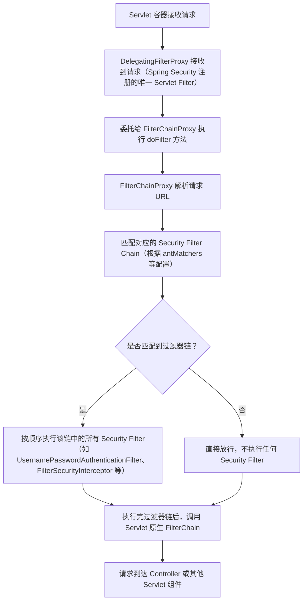

你现在想了解 `FilterChainProxy` 的核心作用，这个类是 Spring Security 框架的核心组件（注意：不是 Spring Web 原生的，是 Spring Security 专属），它的设计思路和你之前关注的 `DelegatingFilterProxy` 有相似的“代理”思想，但定位和作用完全不同——简单说，`FilterChainProxy` 是 Spring Security 所有过滤器的“总入口”，负责管理和执行一组有序的 Security Filter 链。

结合你之前手动管理 Nacos 配置、自定义 Bean 处理器的背景，我会从「核心作用-原理-和 DelegatingFilterProxy 的关系-实际场景」四个维度讲清楚，让你理解它在整个 Spring 生态中的定位。

### 一、`FilterChainProxy` 核心作用
一句话总结：**`FilterChainProxy` 是 Spring Security 的核心过滤器（唯一注册到 Servlet 容器的 Security 相关 Filter），它内部维护了多组「请求路径-过滤器链」的映射关系，能根据请求路径动态匹配并执行对应的 Security Filter 链**。

具体拆解为 3 个核心作用：
1. **统一入口**：Spring Security 框架内部有几十种功能过滤器（如认证过滤器、授权过滤器、CSRF 过滤器、Logout 过滤器等），但不会把这些过滤器逐个注册到 Servlet 容器，而是通过 `FilterChainProxy` 作为“总代理”，只注册这一个 Filter 到 Servlet 容器，所有安全相关请求都先经过它。
2. **动态匹配过滤器链**：支持为不同的请求路径配置不同的过滤器链（比如 `/api/**` 走一套认证逻辑，`/admin/**` 走另一套更严格的认证逻辑），`FilterChainProxy` 会根据请求 URL 匹配对应的过滤器链并执行。
3. **解耦过滤器管理**：Spring Security 的过滤器链由 Spring 容器管理（而非 Servlet 容器），支持动态调整、条件化配置，且能和 Spring 的其他特性（如依赖注入、Nacos 配置刷新）无缝集成——这和你手动管理 Nacos ConfigService、BeanPostProcessor 的思路高度契合。

### 二、为什么需要 `FilterChainProxy`？（没有它会有什么问题）
如果没有 `FilterChainProxy`，Spring Security 要把所有功能过滤器逐个注册到 Servlet 容器，会带来三个核心问题：
1. **过滤器顺序失控**：Spring Security 的过滤器必须按固定顺序执行（比如先执行 CSRF 过滤器，再执行认证过滤器，最后执行授权过滤器），手动注册到 Servlet 容器很难保证顺序；
2. **路径匹配不灵活**：无法为不同路径配置不同的过滤器组合（比如静态资源不需要认证，API 接口需要 JWT 认证）；
3. **和 Spring 容器解耦**：Security 过滤器无法享受 Spring 的依赖注入、配置动态刷新（比如你通过 Nacos 动态调整认证规则，纯 Servlet Filter 无法感知）。

而 `FilterChainProxy` 完美解决了这些问题：它内部维护的过滤器链是 Spring 管理的 Bean，支持有序配置、路径匹配，且能感知配置变化。

### 三、核心原理（执行流程）
先明确一个关键前提：`FilterChainProxy` 本身是一个 `Filter`，它会被 `DelegatingFilterProxy` 委托（这是两者的核心关联），最终注册到 Servlet 容器。

用流程图展示完整执行逻辑：


关键细节：
1. **过滤器链的配置来源**：你在 Spring Security 配置类中通过 `http.authorizeHttpRequests()`、`http.addFilterBefore()` 等配置的规则，最终都会被封装为 `SecurityFilterChain` 类型的 Bean，`FilterChainProxy` 会从 Spring 容器中获取所有 `SecurityFilterChain` Bean，作为匹配的依据。
2. **顺序优先级**：如果多个 `SecurityFilterChain` 都匹配同一个请求 URL，会按 `SecurityFilterChain` Bean 的 `order` 优先级执行（order 越小，优先级越高）。
3. **和 Spring 容器的集成**：`FilterChainProxy` 内部的每个 Security Filter 都是 Spring Bean，能正常依赖注入你手动管理的 Nacos 配置 Bean（如 `MyCustomConfig`），也能通过 `@RefreshScope` 感知 Nacos 配置的动态变化。

### 四、`FilterChainProxy` vs `DelegatingFilterProxy`（核心区别）
你之前问过 `DelegatingFilterProxy`，这里对比两者的核心差异，避免混淆：

| 特性                | `DelegatingFilterProxy`                | `FilterChainProxy`                      |
|---------------------|----------------------------------------|-----------------------------------------|
| 归属                | Spring Web 原生组件                    | Spring Security 专属组件                |
| 核心作用            | 桥接 Servlet Filter 和 Spring Bean     | 管理 Spring Security 多组过滤器链，动态匹配执行 |
| 注册方式            | 可手动注册到 Servlet 容器              | 被 `DelegatingFilterProxy` 委托，间接注册 |
| 管理对象            | 单个 Spring Bean 类型的 Filter         | 多组有序的 Security Filter 链           |
| 核心场景            | 所有需要 Spring 管理 Filter 的场景     | 仅 Spring Security 框架内部使用         |

### 五、和你当前 Nacos 配置场景的关联
在你手动实现 `BeanPostProcessor`、自定义 Nacos 配置加载的场景下，`FilterChainProxy` 的价值体现在：
1. **配置动态生效**：如果你通过 Nacos 动态调整 Spring Security 的规则（比如修改认证白名单、权限配置），`FilterChainProxy` 管理的 `SecurityFilterChain` 能通过 `@RefreshScope` 感知配置变化（需配合自定义配置刷新逻辑），无需重启应用；
2. **依赖注入兼容**：Spring Security 的过滤器（如自定义 JWT 认证过滤器）作为 `FilterChainProxy` 管理的 Bean，能正常注入你从 Nacos 加载的配置（如 JWT 密钥、过期时间）；
3. **和自定义 Bean 协作**：你手动实现的 `BeanPostProcessor` 处理的 Nacos 注解 Bean，能被 `FilterChainProxy` 内部的 Security Filter 正常依赖，不会出现容器隔离的问题。

### 六、简单示例（直观理解配置和执行）
下面是一个 Spring Security 配置类，展示 `FilterChainProxy` 如何管理过滤器链：
```java
@Configuration
@EnableWebSecurity
public class SecurityConfig {

    // 注入从 Nacos 加载的自定义配置（你手动管理的 Bean）
    @Autowired
    private MyCustomConfig customConfig;

    // 定义第一个过滤器链：匹配 /admin/** 路径，需要 ADMIN 权限
    @Bean
    @Order(1) // 优先级更高
    public SecurityFilterChain adminFilterChain(HttpSecurity http) throws Exception {
        http
            .securityMatcher("/admin/**") // 匹配 /admin/** 路径
            .authorizeHttpRequests(auth -> auth
                .anyRequest().hasRole("ADMIN")
            )
            .addFilterBefore(customAdminAuthFilter(), UsernamePasswordAuthenticationFilter.class); // 自定义过滤器
        return http.build();
    }

    // 定义第二个过滤器链：匹配所有路径，默认认证
    @Bean
    @Order(2)
    public SecurityFilterChain defaultFilterChain(HttpSecurity http) throws Exception {
        http
            .authorizeHttpRequests(auth -> auth
                .anyRequest().authenticated()
            )
            .formLogin(); // 表单登录
        return http.build();
    }

    // 自定义过滤器（依赖 Nacos 配置）
    @Bean
    public Filter customAdminAuthFilter() {
        return (request, response, chain) -> {
            // 使用 Nacos 配置的参数
            String adminSecret = customConfig.getAdminSecret();
            // 自定义认证逻辑
            chain.doFilter(request, response);
        };
    }
}
```
在这个示例中：
- `adminFilterChain` 和 `defaultFilterChain` 都是 `SecurityFilterChain` 类型的 Bean；
- 当请求 `/admin/user` 时，`FilterChainProxy` 会匹配 `adminFilterChain`，执行其中的自定义过滤器和权限校验；
- 当请求 `/api/user` 时，会匹配 `defaultFilterChain`，执行表单登录相关的过滤器；
- 所有过滤器的执行都由 `FilterChainProxy` 统一管理，且能使用你从 Nacos 加载的 `customConfig`。

### 总结
1. **核心作用**：`FilterChainProxy` 是 Spring Security 的核心过滤器，作为所有 Security 过滤器的总入口，负责根据请求路径动态匹配并执行对应的过滤器链，是 Spring Security 过滤器管理的核心；
2. **核心关联**：它会被 `DelegatingFilterProxy` 委托，最终注册到 Servlet 容器，是 Spring Security 过滤器与 Servlet 容器交互的桥梁；
3. **核心价值**：解决了 Spring Security 多过滤器链的有序管理、路径动态匹配问题，且内部过滤器能享受 Spring 容器的依赖注入、配置动态刷新等特性（和你手动管理 Nacos 配置的场景完美兼容）。

这个类的设计思路和你手动实现 `BeanPostProcessor` 处理 Nacos 注解的思路一致——都是通过“集中管理+动态匹配”的方式，解耦组件的生命周期和执行逻辑。