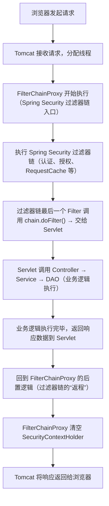

你这个疑问的核心是对「FilterChain（过滤器链）的执行范围」理解有偏差——**`FilterChainProxy` 并不是在到达 Controller 前结束，而是贯穿整个请求处理流程：从请求进入服务器，到 Controller/Service 执行完毕、响应返回前，过滤器链才会执行完**。

我先纠正这个关键认知，再用「可视化流程+代码级拆解」讲清楚，你就能明白为什么 FilterChain 执行完清理 SecurityContext 不影响业务操作。

### 一、先纠正核心认知：Filter 是“包裹”整个请求处理的，而非“只在 Controller 前”
在 Java Web 中，**Filter（过滤器）的执行逻辑是“请求进来先过 Filter，业务处理完（Controller/Service）后，再走 Filter 的后置逻辑，最后返回响应”**——Filter 是“环绕”在 Servlet（Controller 本质是 Servlet）周围的，而非“只在前面”。

用一张图看清完整的请求执行顺序（这是理解的关键）：


#### 关键结论：
`FilterChainProxy` 包含的 Spring Security 过滤器链，**执行到 `chain.doFilter()` 时会“放行”到 Servlet/Controller，但这只是过滤器链的“中途”，而非“结束”**——只有等 Controller/Service 执行完、响应返回时，才会回到过滤器链的后置逻辑，完成整个过滤器链的执行，最后清理 SecurityContext。

### 二、用代码级伪代码拆解：Filter 的“前置+后置”逻辑
为了更直观，我用伪代码模拟一个 Filter 的执行逻辑，你就能看懂 Filter 是“环绕”业务逻辑的：

```java
// 模拟一个 Spring Security 过滤器（比如 SecurityContextPersistenceFilter）
public class MySecurityFilter implements Filter {
    @Override
    public void doFilter(ServletRequest request, ServletResponse response, FilterChain chain) throws IOException, ServletException {
        // ====================== 前置逻辑（请求进来时执行） ======================
        System.out.println("1. 前置：绑定空的 SecurityContext 到当前线程");
        SecurityContextHolder.createEmptyContext();

        try {
            // 核心：调用 chain.doFilter() → 放行到下一个 Filter，最终到 Controller
            // 这一步是“过滤器链的中途”，不是“结束”！
            chain.doFilter(request, response);
        } finally {
            // ====================== 后置逻辑（业务执行完后执行） ======================
            System.out.println("2. 后置：清空 SecurityContext（无论业务是否成功）");
            SecurityContextHolder.clearContext();
        }
    }
}
```

#### 执行流程拆解（对应伪代码）：
1. **请求进来**：先执行 Filter 的「前置逻辑」（绑定空的 SecurityContext）；
2. **放行到业务**：调用 `chain.doFilter()` → 依次执行后续 Filter → 最终到 Controller/Service 执行业务逻辑（此时 SecurityContext 已被认证过滤器填充，业务能获取到）；
3. **业务执行完**：响应返回时，回到 Filter 的「finally 块」→ 执行「后置逻辑」（清空 SecurityContext）；
4. **过滤器链结束**：所有 Filter 的后置逻辑执行完，FilterChainProxy 才算真正执行完毕。

### 三、再回答你的核心疑问：“FilterChainProxy 不应该在到达 Controller 层之前结束吗？”
**答案：FilterChainProxy 并没有在到达 Controller 前“结束”，只是“放行”到 Controller**——

- 「结束」：指整个过滤器链的所有逻辑（前置+后置）都执行完；
- 「放行」：指调用 `chain.doFilter()` 把请求交给下一个组件（后续 Filter/Servlet/Controller），这只是过滤器链执行的“中间步骤”。

举个通俗的例子：
你去餐厅吃饭，Filter 就像“餐厅的门禁+服务员”：
1. 门禁（Filter 前置逻辑）：检查你是否有预约（认证），给你一张就餐卡（绑定 SecurityContext）；
2. 放行（chain.doFilter()）：让你进入餐厅，找服务员点餐（Controller/Service 业务逻辑）——此时你手里的就餐卡（SecurityContext）有效，服务员能看到你的信息；
3. 吃完离店（Filter 后置逻辑）：门禁收回你的就餐卡（清空 SecurityContext），避免你下次来还拿着旧卡（线程复用泄露）。

你不会觉得“门禁在你进入餐厅前就消失了”——门禁一直存在，只是放行你进去吃饭，吃完后才完成整个流程（收回卡）。

### 四、Spring Security 中关键过滤器的执行时序（对应真实场景）
以「表单登录后访问 /admin」为例，看 SecurityContext 的生命周期和 Filter 执行的关系：
1. **请求 /admin** → `SecurityContextPersistenceFilter` 前置逻辑：绑定空的 SecurityContext 到线程；
2. **认证过滤器**：校验登录状态，填充已认证的 Authentication 到 SecurityContext；
3. **授权过滤器**：从 SecurityContext 读取权限，允许访问 /admin；
4. **chain.doFilter()** → 放行到 Controller，Service 中获取 SecurityContext（有值）；
5. **Controller 返回响应** → 回到 `SecurityContextPersistenceFilter` 的 finally 块；
6. **清空 SecurityContext** → FilterChainProxy 执行完毕 → 响应返回浏览器。

### 核心总结（关键点回顾）
1. **Filter 的执行逻辑**：Filter 是“环绕式”的，包含「前置逻辑（请求进来）→ 放行业务 → 后置逻辑（响应返回）」，而非“只在业务前执行”；
2. **FilterChainProxy 的“结束”时机**：不是“放行到 Controller 时”，而是“所有 Filter 的前置+后置逻辑都执行完，响应返回前”；
3. **SecurityContext 清理时机**：在 Filter 的后置逻辑（finally 块）中执行，此时业务逻辑（Controller/Service）已经执行完毕，完全不影响业务获取信息；
4. **清理的目的**：线程执行完请求后，清空 ThreadLocal 中的 SecurityContext，避免 Tomcat 线程池复用线程时泄露用户信息。

简单说：Filter 就像“请求的保镖”，全程跟着请求——先帮请求准备好 SecurityContext（让业务能用），等业务办完事儿，再把 SecurityContext 清理掉（避免泄露），全程不缺席、不添乱。