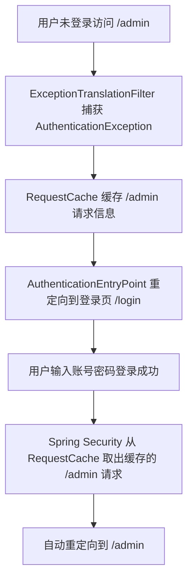

你问到的 `SecurityContextHolder`、`RequestCache` 和“自动重定向”是 `ExceptionTranslationFilter` 处理认证异常时的三个核心细节，我会用通俗的语言+实际场景拆解，让你彻底理解它们的作用和背后的逻辑：

### 一、`SecurityContextHolder`：Spring Security 存储用户认证信息的“全局容器”
#### 1. 核心含义
`SecurityContextHolder` 是 Spring Security 提供的一个**静态工具类**，本质是把 `SecurityContext`（存储当前用户的认证信息：比如用户名、权限、是否登录）绑定到 `ThreadLocal` 上——也就是说，每个请求线程都有自己独立的 `SecurityContext`，互不干扰。

#### 2. 为什么要“清空”它？
当抛出 `AuthenticationException`（比如用户认证失败/未认证）时，`SecurityContext` 里可能残留**无效/过期的认证信息**（比如上一个请求的用户信息、不完整的认证数据），如果不清空会导致两个问题：
- **安全漏洞**：线程池复用线程时，后续请求可能获取到上一个请求的无效用户信息；
- **逻辑混乱**：后续过滤器/业务代码读取到错误的认证状态（比如明明没登录，却显示“已认证”）。

#### 通俗例子
就像你去银行办理业务，上一个客户办完后，柜员必须清空柜台的表单（`SecurityContext`），否则下一个客户会看到上一个人的信息——`SecurityContextHolder.clearContext()` 就是这个“清空表单”的操作。

### 二、`RequestCache`：Spring Security 缓存请求的“临时存储器”
#### 1. 核心含义
`RequestCache` 是 Spring Security 定义的接口，作用是**临时保存当前请求的完整信息**（包括请求 URL、请求方法、参数、Cookie 等），默认实现是 `HttpSessionRequestCache`（把请求缓存到 HttpSession 中）。

#### 2. 为什么要“缓存当前请求”？
用户访问需要认证的资源（比如 `/admin`）时，因为未登录被拦截——如果不缓存这个请求，用户登录成功后，只能回到登录页，而不是原本想访问的 `/admin`，体验极差。
缓存请求的目的就是：**记住用户“最初想访问的页面”，认证成功后自动跳回去**。

#### 通俗例子
你去商场想进 VIP 区（`/admin`），保安拦住你说“先去办会员卡（登录）”——保安会先记下你要去 VIP 区这件事（`RequestCache` 缓存请求），等你办完卡回来，直接带你去 VIP 区，而不是让你重新找路。

### 三、“自动重定向”：缓存请求后的核心体验优化
#### 1. 核心逻辑（完整流程）
结合 `RequestCache` 和认证流程，自动重定向的完整步骤：


#### 2. 关键细节
- **重定向的触发时机**：不是 `ExceptionTranslationFilter` 直接做的，而是**用户登录成功后**，由 `SavedRequestAwareAuthenticationSuccessHandler`（登录成功处理器）触发——它会从 `RequestCache` 中取出缓存的请求，并重定向到该 URL；
- **可配置性**：如果不想自动重定向（比如 API 接口不需要），可以自定义 `AuthenticationSuccessHandler`，关闭 `RequestCache` 的重定向逻辑；
- **只缓存“需要认证的请求”**：只有触发 `AuthenticationException` 的请求才会被缓存，普通请求不会被缓存。

#### 对比：有无 `RequestCache` 的体验差异
| 无 RequestCache（不缓存请求） | 有 RequestCache（缓存请求） |
|------------------------------|----------------------------|
| 未登录访问 /admin → 跳登录页 → 登录成功 → 停在登录页 | 未登录访问 /admin → 跳登录页 → 登录成功 → 自动跳 /admin |

### 四、代码层面的直观理解（配置示例）
#### 1. 默认配置（自动重定向生效）
Spring Security 默认开启 `RequestCache`，无需额外配置：
```java
@Bean
SecurityFilterChain filterChain(HttpSecurity http) throws Exception {
    http
        .authorizeHttpRequests(auth -> auth
            .requestMatchers("/login").permitAll()
            .anyRequest().authenticated() // 所有请求需要认证
        )
        .formLogin(form -> form
            // 登录页地址
            .loginPage("/login")
            // 登录成功后，默认从 RequestCache 取缓存请求重定向
            .successHandler(new SavedRequestAwareAuthenticationSuccessHandler())
        );
    return http.build();
}
```

#### 2. 关闭自动重定向（比如 API 接口）
如果是前后端分离的 API 接口，不需要重定向，可关闭 `RequestCache`：
```java
@Bean
SecurityFilterChain filterChain(HttpSecurity http) throws Exception {
    http
        .authorizeHttpRequests(auth -> auth.anyRequest().authenticated())
        .exceptionHandling(ex -> ex
            // API 接口遇到认证异常，返回 401 而不是重定向
            .authenticationEntryPoint((request, response, authException) -> {
                response.setStatus(401);
                response.getWriter().write("未认证，请先登录");
            })
        )
        // 禁用 RequestCache，不缓存请求
        .requestCache(request -> request.disable());
    return http.build();
}
```

### 总结
1. **`SecurityContextHolder`**：存储当前线程的用户认证信息，认证异常时清空是为了避免无效信息残留，保证线程安全；
2. **`RequestCache`**：临时缓存用户未认证时想访问的请求信息，是“自动重定向”的基础；
3. **自动重定向**：登录成功后，从 `RequestCache` 取出缓存的请求，跳转到用户最初想访问的页面，核心是优化用户体验；
4. **核心关联**：`ExceptionTranslationFilter` 负责“缓存请求+引导认证”，登录成功处理器负责“读取缓存+重定向”，三者配合完成“未认证→引导登录→跳回原页面”的完整流程。

这三个组件的设计，本质是 Spring Security 从“功能实现”到“用户体验”的优化，既保证了安全，又兼顾了使用便捷性。