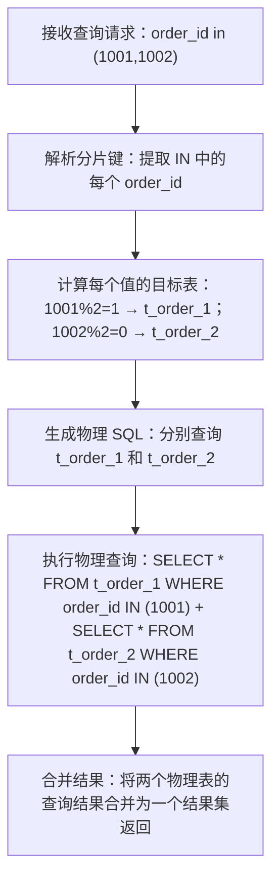

你问的 `select * from t_order where order_id in ( ? , ? )` 这种带 `IN` 条件的查询语句，Sharding-JDBC（4.1.1 版本）会按照**分片键的路由规则自动拆分查询**，核心逻辑是“先计算每个 IN 元素的目标表，再对所有涉及的物理表执行查询，最后合并结果”。下面我会详细拆解处理流程、给出示例，并说明关键注意事项。

### 一、核心处理流程（以你的分片规则 `order_id % 2` 为例）
假设你执行的 SQL 是：`select * from t_order where order_id in (1001, 1002)`，Sharding-JDBC 的处理步骤如下：


### 二、具体示例（直观理解）
#### 1. 场景1：IN 中的值路由到**多个物理表**
- 执行 SQL：`select * from t_order where order_id in (1705200000000000001, 1705200000000000002)`
- Sharding-JDBC 计算：
    - 1705200000000000001 % 2 = 1 → 目标表 `t_order_1`
    - 1705200000000000002 % 2 = 0 → 目标表 `t_order_2`
- 实际执行的物理 SQL（日志中可看到）：
  ```sql
  SELECT * FROM t_order_1 WHERE order_id IN (1705200000000000001);
  SELECT * FROM t_order_2 WHERE order_id IN (1705200000000000002);
  ```
- 返回结果：合并两个表的查询结果，按 `order_id` 排序（默认）。

#### 2. 场景2：IN 中的值路由到**同一个物理表**
- 执行 SQL：`select * from t_order where order_id in (1705200000000000001, 1705200000000000003)`
- Sharding-JDBC 计算：
    - 1705200000000000001 % 2 = 1 → `t_order_1`
    - 1705200000000000003 % 2 = 1 → `t_order_1`
- 实际执行的物理 SQL：
  ```sql
  SELECT * FROM t_order_1 WHERE order_id IN (1705200000000000001, 1705200000000000003);
  ```
- 返回结果：直接返回 `t_order_1` 的查询结果。

### 三、关键特性与注意事项
#### 1. 自动去重物理表
Sharding-JDBC 会对计算出的目标表去重，比如 IN 中有 10 个值但都路由到 `t_order_1`，只会执行 1 次查询，不会重复执行。

#### 2. 空值/无效值处理
- 若 IN 中包含 `null`（如 `order_id in (null, 1001)`）：
  Sharding-JDBC 会抛出 `Sharding value must implements Comparable` 异常（和你之前遇到的异常一致），因为 `null` 无法执行取模运算；
- 若 IN 中包含非数字值（如字符串）：
  会直接抛出类型转换异常，因为分片键 `order_id` 是 Long 类型。

#### 3. 性能优化建议
- **IN 元素不宜过多**：若 IN 中有 1000 个值，Sharding-JDBC 会先计算每个值的目标表，再拆分查询，过多元素会导致：
  ① 路由计算耗时增加；② 物理查询次数增多（最多等于分片表数量，如你这里最多 2 次）；
- **优先按分片键范围查询**：如果业务允许，用 `order_id between ? and ?` 替代 `IN`，Sharding-JDBC 会根据范围计算目标表，查询次数更少（比如 `between 1001 and 1005` 最多只查 2 个表）。

#### 4. 4.1.1 版本的小坑
- 若 IN 中包含大量值（如 1000+），4.1.1 版本可能出现“路由计算超时”，建议：
  ① 分批执行 IN 查询；② 升级到 4.1.1 最新补丁版；
- 不支持 `IN` 嵌套子查询（如 `order_id in (select id from t_temp)`），4.1.1 会直接抛出不支持的异常，需改为先查子查询结果，再用 IN 查询。

### 四、代码验证示例（实际测试）
#### 1. Controller 中添加 IN 查询接口
```java
@GetMapping("/queryByIds")
public List<OrderDO> queryByIds() {
    // 模拟 IN 查询：order_id in (1705200000000000001, 1705200000000000002)
    Example example = new Example(OrderDO.class);
    Example.Criteria criteria = example.createCriteria();
    criteria.andIn("orderId", Arrays.asList(1705200000000000001L, 1705200000000000002L));
    
    // 通用 Mapper 的 selectByExample 方法
    return orderMapper.selectByExample(example);
}
```

#### 2. 日志验证
访问 `http://localhost:8080/queryByIds`，日志会显示：
```
ShardingSphere-SQL - Actual SQL: order-db ::: SELECT * FROM t_order_1 WHERE order_id IN (1705200000000000001)
ShardingSphere-SQL - Actual SQL: order-db ::: SELECT * FROM t_order_2 WHERE order_id IN (1705200000000000002)
```
返回结果是两个表的合并数据。

### 总结
### 关键点回顾
1. **核心逻辑**：Sharding-JDBC 会解析 IN 中的每个分片键值，计算各自的目标物理表，拆分查询后合并结果；
2. **路由规则**：和单值查询一致（如你的 `order_id % 2`），多值仅增加“去重物理表”步骤；
3. **避坑重点**：IN 中不能包含 null，元素数量不宜过多，4.1.1 不支持 IN 嵌套子查询；
4. **性能建议**：优先用范围查询（between）替代大量值的 IN 查询。

简单来说，这种 IN 查询对 Sharding-JDBC 是完全支持的，处理逻辑符合直觉，只需注意空值和性能问题即可。