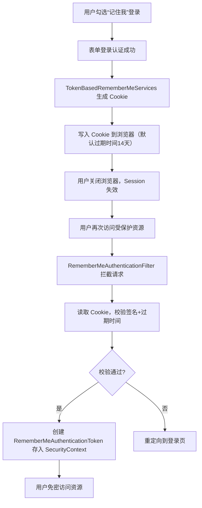
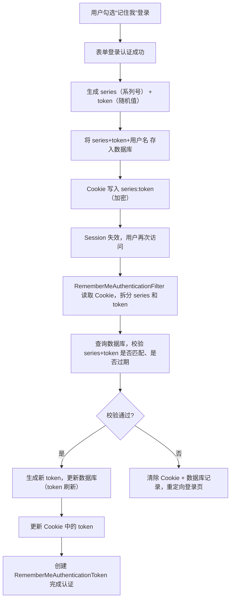

你问到的 `RememberMeServices` 是 Spring Security 中实现「记住我（免密登录）」功能的核心接口，它的本质是：**在用户勾选“记住我”登录后，通过浏览器 Cookie 持久化认证信息，下次访问时无需重新输入账号密码，自动完成认证**。

下面我从「核心原理、执行流程、内置实现、实战配置」四个维度，把 `RememberMeServices` 的原理讲透，让你明白“记住我”功能是如何安全实现的。

### 一、先明确核心概念：为什么需要 RememberMeServices？
普通表单登录的认证态是基于 `HttpSession` 的——Session 过期/浏览器关闭后，认证态丢失，用户需要重新登录；而「记住我」功能通过 **持久化 Cookie** 突破 Session 的限制，即使 Session 失效，只要 Cookie 未过期，就能自动恢复认证态。

`RememberMeServices` 的核心目标：
1. 登录成功时：生成并写入“记住我”Cookie 到浏览器；
2. 后续请求时：校验 Cookie 合法性，自动创建认证对象（`RememberMeAuthenticationToken`）；
3. 退出登录时：清除“记住我”Cookie，失效免密登录。

### 二、RememberMeServices 的核心原理（分两种实现）
Spring Security 提供了两种核心实现类，对应不同的“记住我”实现方案，原理差异很大：

| 实现类 | 核心原理 | 安全性 | 适用场景 |
|--------|----------|--------|----------|
| `TokenBasedRememberMeServices` | 基于加密 Token 的无状态方案：Cookie 中存储「用户名 + 过期时间 + 加密签名」，服务端不存储任何信息 | 中（依赖加密密钥安全） | 小型应用、无数据库场景 |
| `PersistentTokenBasedRememberMeServices` | 基于数据库的有状态方案：Cookie 中存储「随机 Token + 系列号」，服务端数据库存储 Token 对应信息（用户名、过期时间等） | 高（Token 可作废、可追溯） | 生产环境、需管控记住我登录的场景 |

#### 1. 核心原理1：TokenBasedRememberMeServices（无状态）
##### （1）Cookie 内容格式
Cookie 名称默认是 `remember-me`，值是经过加密的字符串，格式为：
```
用户名:过期时间戳:加密签名
```
- 加密签名：通过「密钥 + 用户名 + 过期时间 + 密码」生成（HMAC-SHA256），防止 Cookie 被篡改；
- 密码参与签名：如果用户修改了密码，旧的“记住我”Cookie 会自动失效（核心安全设计）。

##### （2）核心流程（登录+自动认证）


##### （3）关键安全点
- Cookie 是 **HttpOnly** 的（无法通过 JS 读取），防止 XSS 攻击；
- Cookie 可配置为 **Secure**（仅 HTTPS 传输），防止中间人攻击；
- 签名密钥（`key`）必须保密：一旦密钥泄露，攻击者可伪造 Cookie；
- 密码参与签名：用户改密码后，旧 Cookie 自动失效，避免旧 Token 被滥用。

#### 2. 核心原理2：PersistentTokenBasedRememberMeServices（有状态）
这是生产环境推荐的方案，核心是“服务端存储 Token 信息”，可管控、可作废。

##### （1）核心组件
- `PersistentTokenRepository`：Token 存储仓库（默认实现 `JdbcTokenRepositoryImpl`，基于数据库）；
- 数据库表：默认表名 `persistent_logins`，字段包括：
  | 字段 | 作用 |
  |------|------|
  | `username` | 关联的用户名 |
  | `series` | 系列号（不变，标识一个“记住我”会话） |
  | `token` | 随机 Token（每次自动登录后刷新） |
  | `last_used` | 最后使用时间 |

##### （2）核心流程（登录+自动认证）


##### （3）关键安全点
- **Token 刷新机制**：每次自动登录后，token 会刷新（series 不变），即使 token 泄露，也只能用一次；
- **可手动作废**：后台可删除 `persistent_logins` 中的记录，立即失效某个用户的“记住我”登录；
- **过期管控**：可通过 `last_used` 清理长期未使用的 Token，降低泄露风险。

### 三、RememberMeServices 的完整执行流程（框架层面）
结合 Spring Security 过滤器链，看 `RememberMeServices` 是如何集成的：

#### 1. 登录阶段（生成记住我 Cookie）
```
用户提交登录请求 → UsernamePasswordAuthenticationFilter 拦截 → 认证成功 → 调用 RememberMeServices.onLoginSuccess() → 生成并写入 Cookie
```
- `onLoginSuccess()`：核心方法，负责生成 Cookie 并写入响应头；
- 如果用户未勾选“记住我”，该方法不会执行。

#### 2. 自动认证阶段（校验 Cookie）
```
用户访问受保护资源 → SecurityContext 中无认证信息 → RememberMeAuthenticationFilter 拦截 → 调用 RememberMeServices.autoLogin() → 校验 Cookie → 生成 RememberMeAuthenticationToken → 存入 SecurityContext
```
- `autoLogin()`：核心方法，读取并校验 Cookie，返回认证对象（失败则返回 null）；
- `RememberMeAuthenticationFilter` 执行优先级低于普通认证过滤器，只处理“未认证但有记住我 Cookie”的请求。

#### 3. 退出登录阶段（清除 Cookie）
```
用户退出登录 → LogoutFilter 拦截 → 调用 RememberMeServices.logout() → 清除浏览器 Cookie + 数据库记录（如有）
```
- `logout()`：核心方法，失效“记住我”认证态。

### 四、实战配置：如何启用 RememberMeServices
#### 场景1：无状态方案（TokenBasedRememberMeServices）
```java
import org.springframework.context.annotation.Bean;
import org.springframework.org.lix.mycatdemo.security.config.annotation.web.builders.HttpSecurity;
import org.springframework.org.lix.mycatdemo.security.config.annotation.web.configuration.EnableWebSecurity;
import org.springframework.org.lix.mycatdemo.security.core.userdetails.UserDetailsService;
import org.springframework.org.lix.mycatdemo.security.crypto.password.PasswordEncoder;
import org.springframework.org.lix.mycatdemo.security.web.SecurityFilterChain;
import org.springframework.org.lix.mycatdemo.security.web.authentication.rememberme.TokenBasedRememberMeServices;

@EnableWebSecurity
public class SecurityConfig {

    private final UserDetailsService userDetailsService;
    private final PasswordEncoder passwordEncoder;

    // 注入用户信息服务和密码编码器
    public SecurityConfig(UserDetailsService userDetailsService, PasswordEncoder passwordEncoder) {
        this.userDetailsService = userDetailsService;
        this.passwordEncoder = passwordEncoder;
    }

    // 1. 配置 RememberMeServices（无状态）
    @Bean
    public TokenBasedRememberMeServices rememberMeServices() {
        // 核心：加密密钥（必须保密，建议用随机字符串）
        String rememberMeKey = "your-secret-remember-me-key-123456";
        TokenBasedRememberMeServices services = new TokenBasedRememberMeServices(rememberMeKey, userDetailsService);
        // 配置 Cookie 过期时间（单位：秒，默认14天=1209600秒）
        services.setTokenValiditySeconds(60 * 60 * 24 * 7); // 7天
        // 配置 Cookie 为 HttpOnly + Secure（生产环境建议开启Secure）
        services.setUseSecureCookie(true); // 仅HTTPS传输
        services.setCookieName("my-remember-me"); // 自定义Cookie名称
        return services;
    }

    // 2. 配置 SecurityFilterChain，启用记住我
    @Bean
    public SecurityFilterChain filterChain(HttpSecurity http) throws Exception {
        http
                .authorizeHttpRequests(auth -> auth
                        .anyRequest().authenticated()
                )
                .formLogin() // 启用表单登录
                .and()
                .rememberMe(rememberMe -> rememberMe
                        .rememberMeServices(rememberMeServices()) // 关联自定义的 RememberMeServices
                        .rememberMeParameter("remember-me") // 前端勾选框的参数名（默认就是remember-me）
                );
        return http.build();
    }

    // 配置密码编码器
    @Bean
    public PasswordEncoder passwordEncoder() {
        return new BCryptPasswordEncoder();
    }
}
```

#### 场景2：有状态方案（PersistentTokenBasedRememberMeServices）
```java
import org.springframework.context.annotation.Bean;
import org.springframework.org.lix.mycatdemo.security.config.annotation.web.builders.HttpSecurity;
import org.springframework.org.lix.mycatdemo.security.config.annotation.web.configuration.EnableWebSecurity;
import org.springframework.org.lix.mycatdemo.security.core.userdetails.UserDetailsService;
import org.springframework.org.lix.mycatdemo.security.web.SecurityFilterChain;
import org.springframework.org.lix.mycatdemo.security.web.authentication.rememberme.JdbcTokenRepositoryImpl;
import org.springframework.org.lix.mycatdemo.security.web.authentication.rememberme.PersistentTokenBasedRememberMeServices;
import org.springframework.org.lix.mycatdemo.security.web.authentication.rememberme.PersistentTokenRepository;

import javax.sql.DataSource;

@EnableWebSecurity
public class PersistentRememberMeConfig {

    private final DataSource dataSource; // 注入数据源（Spring Boot 自动配置）
    private final UserDetailsService userDetailsService;

    public PersistentRememberMeConfig(DataSource dataSource, UserDetailsService userDetailsService) {
        this.dataSource = dataSource;
        this.userDetailsService = userDetailsService;
    }

    // 1. 配置 Token 仓库（数据库）
    @Bean
    public PersistentTokenRepository persistentTokenRepository() {
        JdbcTokenRepositoryImpl repository = new JdbcTokenRepositoryImpl();
        repository.setDataSource(dataSource);
        // 首次启动时自动创建 persistent_logins 表（生产环境建议手动建表，注释掉这行）
        // repository.setCreateTableOnStartup(true);
        return repository;
    }

    // 2. 配置 PersistentTokenBasedRememberMeServices
    @Bean
    public PersistentTokenBasedRememberMeServices rememberMeServices() {
        String rememberMeKey = "your-persistent-secret-key-789";
        PersistentTokenBasedRememberMeServices services = new PersistentTokenBasedRememberMeServices(
                rememberMeKey, userDetailsService, persistentTokenRepository()
        );
        services.setTokenValiditySeconds(60 * 60 * 24 * 30); // 30天过期
        services.setUseSecureCookie(true);
        return services;
    }

    // 3. 启用记住我
    @Bean
    public SecurityFilterChain filterChain(HttpSecurity http) throws Exception {
        http
                .authorizeHttpRequests(auth -> auth.anyRequest().authenticated())
                .formLogin()
                .and()
                .rememberMe(rememberMe -> rememberMe
                        .rememberMeServices(rememberMeServices())
                );
        return http.build();
    }
}
```

### 五、核心安全注意事项（必看！）
1. **加密密钥必须保密**：`RememberMeServices` 的加密密钥（`key`）是核心，建议放在配置中心，不要硬编码；
2. **Cookie 安全配置**：必须开启 `HttpOnly`（默认开启），生产环境开启 `Secure`（仅 HTTPS）；
3. **过期时间不宜过长**：建议7-30天，过长会增加 Cookie 泄露风险；
4. **记住我认证的权限控制**：`RememberMeAuthenticationToken` 的权限应低于普通登录（比如禁止用记住我登录后执行敏感操作，如修改密码）；
   ```java
   // 示例：限制记住我登录不能访问敏感接口
   @PreAuthorize("!authentication instanceof RememberMeAuthenticationToken")
   @GetMapping("/user/changePassword")
   public String changePassword() {
       return "修改密码页面";
   }
   ```

### 总结
#### 关键点回顾
1. **核心原理**：
    - 无状态（`TokenBasedRememberMeServices`）：Cookie 存储加密的「用户名+过期时间+签名」，服务端无存储，依赖密钥和密码签名保证安全；
    - 有状态（`PersistentTokenBasedRememberMeServices`）：Cookie 存储「series+token」，服务端数据库存储对应信息，支持 Token 刷新和作废，安全性更高；
2. **执行流程**：
    - 登录：生成并写入 Cookie；
    - 后续请求：`RememberMeAuthenticationFilter` 调用 `autoLogin()` 校验 Cookie，自动创建认证对象；
    - 退出：清除 Cookie 和服务端记录；
3. **核心安全设计**：
    - Cookie 是 HttpOnly/Secure，防 XSS/中间人攻击；
    - 密码参与签名（无状态）/Token 刷新（有状态），降低泄露风险；
4. **生产建议**：优先使用 `PersistentTokenBasedRememberMeServices`，可管控、可追溯，更适合生产环境。

简单说，`RememberMeServices` 是 Spring Security 对“免密登录”的标准化实现——它把 Cookie 生成、校验、失效的逻辑封装成接口，你只需配置密钥/数据库，就能安全实现“记住我”功能，无需关心底层加密和校验细节。